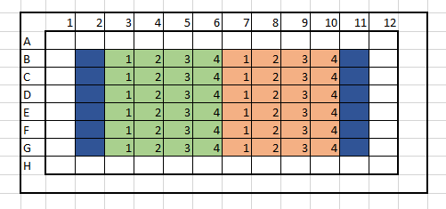

# CVquant
R script to read and process crystal violet assays  

This script loads all .txt files in the input folder.   

Microtiter plates are prepared with 4 biological replicate of 2 strains and 6 technical replicates for each bio replicate. 
with the following layout:  

  

The blue areas are blank controls without bacteria (ie PBS or growth media)  
The green area is strain 1, and the orange area is strain 2.  
Numbers inside the squares indicate biological replicates  

